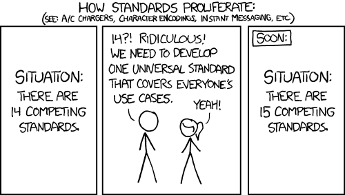
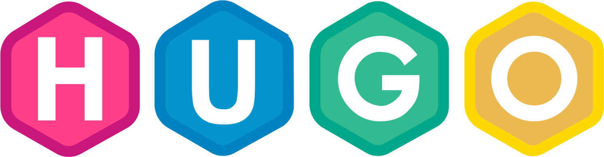
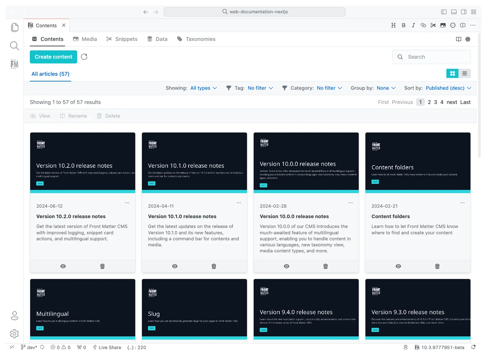

<!-- _class: title -->
# Markdown Madness

## <span class="purple-text">Static Sites for Fun & Profit</span>

<span class="name">Gilbert Sanchez</span>
<span class="handle">@HeyItsGilbert</span>

<!---

10:30a Thursday

Description:
You already write Markdown. README.md, meeting notes, maybe even your grocery list. But what if that Markdown could become a blog, a polished docs site, a personal resume, or even a link-in-bio page? Turns out, it can - and the tools are way cooler (and easier) than you think.

In this session, we'll go on a whirlwind tour of static site generators: Jekyll, MkDocs, Hugo, Docusaurus, plus some delightful "non-docs" options like jsonresume and littlelink.io. We'll talk about what each is good at, how to pick the right one, and how to actually get it online without sacrificing weekends to YAML. Along the way, we'll also cover Markdown/MDX tricks and VS Code extensions to keep things sane.

Whether you're looking to document your project, polish your personal brand, or just hack together something fun, you'll leave knowing how to take plain Markdown and ship it as something awesome.

Key Take-Aways from your session:
- Learn the strengths and tradeoffs of popular static site generators (Jekyll, MkDocs, Hugo, Docusaurus, etc.).
- Discover "non-docs" generators like jsonresume and littlelink.io.
- Understand Markdown vs. MDX and when each makes sense.
- Use VS Code tools to lint, edit, and manage Markdown like a pro.
- Deploy your site easily (GitHub Actions, Netlify, containers) without breaking a sweat.

--->
---
<!-- class: centered -->

# Agenda

- Markup? Markdown?
- Static Sites
- Tools
- Demos
- Q&A

<!--

- Slides (~25m)
  - Markup Languages
  - Markdown Flavors
  - Static Sites
  - Tools
- 10m Break
- Demos
- Q&A

I can fill 90m+ on this topic, but beyond just Q&A I want to step through real
requests.
-->

---

<!-- _class: sponsors -->
<!-- _paginate: skip -->

# Thanks

---

# Hey! It's Gilbert

<!-- Author slide -->

- Staff Software Development Engineer
- ADHD 🌶️🧠
- [Links.GilbertSanchez.com](https://links.gilbertsanchez.com)


<!--
Formerly known as Senor Systems Engineer at Meta

Audience Poll: Who has a blog?

My history as a "webmaster"
-->

---

<!-- _class: big-statement -->

# But First... A Warning

### _This talk is mostly about markdown... but anything goes when it comes to static generation!_

---
<!-- transition: fade -->
<!-- _class: big-statement --->

# What is Markdown?

### _A lightweight __markup__ language for easily formatting text._

---

# What is Markdown?

A lightweight __markup__ language for easily formatting text.

- Markdown (md)
- Asciidoc (adoc)
- reStructuredText (reST)

---
<!-- _class: big-statement -->


_You think this is PowerPoint you're watching?_

<!--
This is actually marp!
-->

---

# Flavor Examples

- ~~Strikethroughs~~
- Footnotes [^1]
- ^Superscript
- Tables
- Math
- Mermaid
- [x] Task List

<span class="small">
[^1]: Give 5 stars
</span>

<!--
Flavors

- GitHub Flavored
- ExtraMark
- etc.

-->

---

<!--
header: ''
_footer: 'https://xkcd.com/927/'
-->



---

# Hello world time

<div class="columns">
<div>

```md
# Hello

Hello world!

## Turtles

I *like* them!
```

</div>
<div style="border-left: 4px solid var(--primary-color); padding-left: 1.5rem;">

<h1 style="font-size: 2rem; margin: 0.2em 0; color: var(--primary-color);">Hello</h1>
<p style="font-size: 1.75rem; margin: 0.2em 0;">Hello world!</p>
<h2 style="font-size: 1.85rem; margin: 0.4em 0 0.2em; color: var(--secondary-color);">Turtles</h2>
<p style="font-size: 1.75rem; margin: 0.2em 0;">I <em>like</em> them!</p>

</div>
</div>

---

# Front Matter

Front matter is YAML provides metadata or configuration.

```markdown
---
title: Hello
---
# Hello

Hello world!
```

<!--
There is also back matter at the bottom.
-->

---

# Static Sites

Static sites are:

1. CLI-generated
2. Output as HTML
3. No runtime server.

---

<!-- _backgroundColor: #fbe9e7 -->

# Jekyll


- Written in __Ruby__
- Great for docs and blogs
- GitHub Pages built-in support
- Liquid templating
- Mature ecosystem with many themes

<!--
The OG of static site generators. Been around since 2008.
GitHub Pages runs Jekyll natively — zero config deploy.
-->

---

<!-- _backgroundColor: #e0f2f1 -->

# MkDocs


- Written in __Python__
- Purpose-built for documentation
- Material for MkDocs theme is excellent
- Simple `mkdocs.yml` configuration
- Live reload dev server

<!--
If you're documenting a project, this is probably the one.
Material theme makes it look professional with minimal effort.
-->

---

<!-- _backgroundColor: #fff8e1 -->

# Hugo



- Written in __Go__
- Blazingly fast builds
- Docs, blogs, portfolios, and more
- Powerful templating and shortcodes
- Single binary, no dependencies

<!--
Hugo is the Swiss Army knife. Fast builds even with thousands of pages.
Great if you want more than just docs.
-->

---

<!-- _backgroundColor: #e8f5e9 -->

# Docusaurus


- Written in __React__
- Built for documentation sites
- MDX support (Markdown + JSX)
- Versioned docs out of the box
- Built-in search and i18n

<!--
From Meta (Facebook). If your team already knows React, this is a natural fit.
MDX lets you embed interactive components in your docs.
-->

---

# VSCode Extensions

- GitHub Markdown Preview
- markdownlint
- Reflow Markdown
- Markdown All in One
- Marp for VS Code

---

<!-- _class: no-bg -->

# FrontMatter CMS

VSCode Extension to punches above it's weight class.



---

# Tools

- markdownlint: Markdown best practices.
- Vale: Prose syntax.
- alex: Catch insensitive writing.
- Docker: Run in a container.

_Maybe Your Favorite LLM?_

---

<!--

Goal: 25m - ~11a

--->

# Deploying Services

- GitHub Pages
- Netlify
- Cloudflare
- Vercel
- So many more...

---

<!-- _class: big-statement -->
# Demo Time

---
<!-- _class: title -->
# <span class="gradient-text">THANK YOU</span>

## <span class="primary">Feedback</span> is a <span class="quaternary">gift</span>

<p class="name">Please review this session via the mobile app</p>
<p class="handle">Questions? Find me @heyitsgilbert</p>
