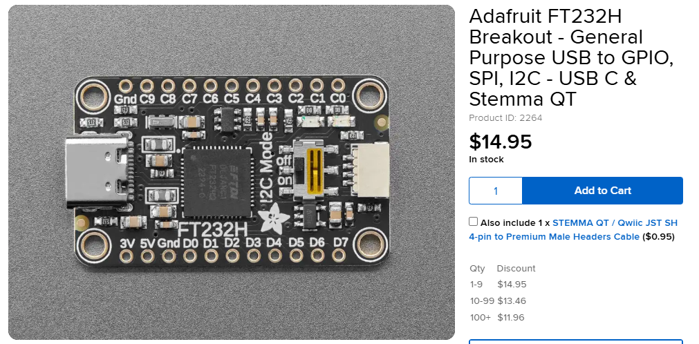
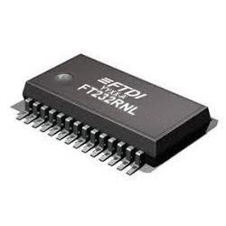
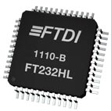
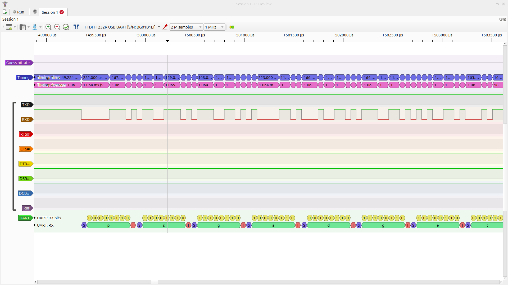
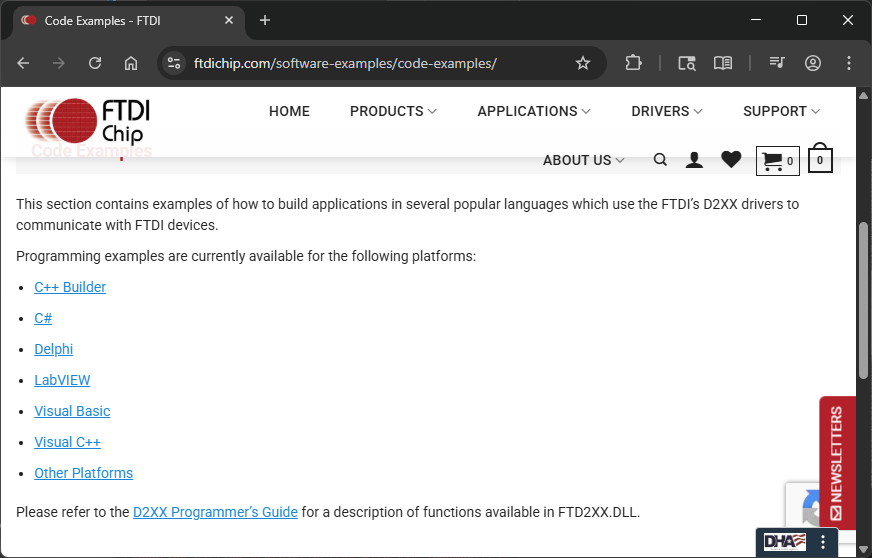
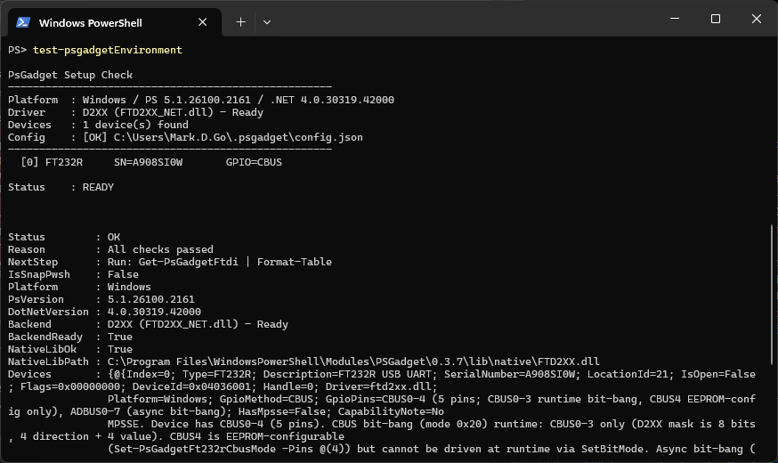
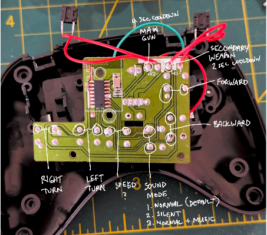

<style>
img[alt~="center"] {
  display: block;
  margin: 0 auto;
}
</style>

<!-- _class: title -->
# <span class="gradient-text">PsGadget</span>
## From Scripts to Circuits
### PowerShell for Hardware Hackers

### "Let's play in serial bus traffic"

<p class="name">with Mark Go</p>

---

<!-- _class: no_background -->

## <span class="gradient-text"> Mark Go? Who is this guy?</span>

<div class="callout secondary">

- Husband + Two offsprings + Loves a particular mini poodle 
- A nerd, a cyclist, and I baked sourdough bread before COVID19

- For my day job, I manage Laboratory Information Systems (LIS)
- Medical Laboratory Technician for 10 years before IT

- Trauma/Combat/Emergency Medicine Technician
- Retired Navy (Hospital Corpsman NEC 8404, iykyk)
- Every plant I try to nurture immediately dies
- I had a pet monkey for a week. Ask me later. Warning: sad ending.

</div>

---

<!-- _class: title -->
# <span class="gradient-text">Thank You to Our Sponsors</span>

<!-- _class: sponsors -->

---

<!-- _class: no_background -->

# <span class="gradient-text">[ DEMO ]</span>

let us pray -- to the demo gods
<br>

<div class="callout gradient">

<span class="primary-bg">$gadget_tank</span> FT232H → MPSSE GPIO → RF Remote Controller → ~~toy~~ Tank!

<br>

<span class="quaternary-bg">$gadget_display</span> FT232H → MPSSE I²C → SSD1306 OLED Matrix Display

<br>

</div>

---

<!-- _class: no_background -->

<br>
<br>

## <span class="gradient-text">Joe Rogan once asked me a question... </span>
<div class="callout secondary">

## If I left you alone in the woods with a hatchet... how long before you could send me an email?

</div>
<br>
<br>
(This is the philosophical center of my journey and this presentation.)

---
<!-- _class: no_background -->

## <span class="gradient-text"> And I've been thinking about that ever since... </span>

Ore mining. Refining. Metallurgy. Silicon foundries. Photolithography. Doping. Semiconductor fabrication. Transistor Arrays. Die cutting. Wire bonding. Packaging. Soldering. PCBs. Logic gates. Clock cycles. Timing synchronization. Power regulation. Bootloaders. Firmware. Microcode. Instruction sets. CPU architectures. Memory hierarchies. Cache coherence. Interrupt handling. USB stacks. Serial drivers. Device drivers. Kernel modules. OS kernel. Process scheduling. Memory management. Networking stacks. TCP/IP. Ethernet. ARP. DNS. DHCP. TLS/SSL. Cryptography. SMTP. MIME encoding. Email routing. BGP. ISP peering. Undersea cables. Data centers. Load balancers. Cooling systems. Power grids. Redundancy. Error correction. Fiber optic transmission. Optical amplifiers. Submarine cable networks...

---

<div class="callout primary">

# The technology stack that would enable us to send Joe Rogan an email requires the collective achievement of humanity.

</div>

#### So how do you eat an elephant? 

#### One chip at a time.

---

<!-- _class: no_background -->

## Adafruit FTDI FT232H breakout board



> Wouldn't it be cool to drive a tiny OLED display, read a color sensor, or even just flash some LEDs directly from your computer? -- Limor Fried "ladyada" (probably)

---


<!-- _class: no_background -->

## Why not just use other popular chips?

#### My objective is *direct* control from within *PowerShell* as the brain of the operation, not outsource it to firmware on a chip.

|Board|What it is |Cons |
|-|-|-|
| <span class="primary-bg">**Arduino**</span> | Popular open-source platform | Code lives on the board |
| <span class="primary-bg">**ESP32**</span> | Another hugely popular platform | Firmware deployed separately |
| <span class="primary-bg">**Pico/PicoW**</span> | Raspberry Pi RP2040-based | Code must be deployed to device |
| <span class="primary-bg">**STM32 / NXP / TI / etc**</span> | Industrial microcontrollers | All require firmware on the chip |

---


### PowerShell already supports serial communication, doesn't it?


```powershell
# Windows only
Get-PnpDevice | ? PNPClass -match port | ? status -eq OK | fl instanceid,friendlyname
# or
[System.IO.Ports.SerialPort]::GetPortNames()
```

```powershell
$port = [System.IO.Ports.SerialPort]::new("COM4", 9600)
$port = [System.IO.Ports.SerialPort]::new("/dev/ttyUSB1", 9600)
$port.Open()
$port.WriteLine("psgadget")
$port.ReadLine()
$port.close()
$port.Dispose()
```

<div class="callout secondary">

### But serial is just the beginning, and you still need hardware...

</div>

---

## Future Tech Devices Incorporated (FTDI) Chips

|Chip|Name|What it is |What it do |
|-|-|-|-|
| | <span class="primary-bg">**FT232R**</span> | Commonly used for USB-to-Serial adapters. Hidden GPIO pins! ~$5. | Converts USB packets to serial signals by bit-bang |
|  | <span class="primary-bg">**FT232H**</span> | Same same, but more GPIO pins + MPSSE for even more awesome. ~$15 approx. | Converts USB packets from host to serial signals... but more fancily |


---

<!-- _class: no_background -->

<br>
<br>
<div class="callout secondary">

## FTDI Multi-Protocol Synchronous Serial Engine (MPSSE) 

<div class="callout tertiary">

### a physical command processor built into the FT232H chip — you send it opcodes and it handles all the clock-and-data timing natively, without PowerShell managing each bit.

</div>

<br>

<div class="callout tertiary">

### "bitbang" literally means banging out one bit at a time

</div>

</div>


---

<!-- _class: no_background -->

# <span class="gradient-text">Example: Decoded UART signal<span>



---

<!-- _class: no_background -->

# <span class="gradient-text">Good news! </span>

### FTDI provides a C# managed wrapper for their native C driver!


---

<!-- _class: no_background -->

# <span class="gradient-text"> Other existing projects: </span>

1. DotNET IoT libraries
2. FTDISharp by ScottWHarden
3. nanoFramework (run C# on microcontrollers!)

```powershell
dotnet package search System.Device.Gpio --take 1
dotnet package search Iot.Device.Bindings --take 1
dotnet package search FTDISharp --take 1
dotnet package search nanoFramework --take 20
```

## But nothing for the PowerShell community

---

<!-- _class: no_background -->

### So I created a PowerShell Module: 

## <span class="primary-bg">PsGadget</span>

```powershell
Find-Module PSGadget

Install-Module PSGadget

Import-Module PSGadget
```

---

<!-- _class: no_background -->


## <span class="primary-bg">PsGadget</span>

<div class="callout tertiary">

- Cmdlets or objects — use whichever fits your use-case
- Verb-Noun cmdlets
- Returns objects, not byte arrays
- Works in PS 5.1 and PS 7+
- Cross-Platform (stretch goal)
- Libraries and dependencies included

</div>

--- 

# Test-PsGadgetEnvironment



---

# New-PsGadgetFtdi

<div class="columns divided">
<div>

before PsGadget

```powershell
Add-Type -Path "FTD2XX_NET.dll"
$ftdi = [FTD2XX_NET.FTDI]::new()
$ftdi.OpenByIndex(0)
$ftdi.SetBitMode(0x0F, 0x02)
$ftdi.SetTimeouts(5000, 5000)
[uint32]$written = 0
$ftdi.Write(
  [byte[]](0x82, 0x01, 0x0F),
  3, [ref]$written)
```

</div>
<div>

PsGadget

```powershell
$gadget = New-PsGadgetFtdi -Index 0
$gadget.SetPin(0, 'HIGH')

# Or cmdlet form with duration
Set-PsGadgetGpio -PsGadget $gadget `
  -Pins @(0) -State HIGH `
  -DurationMs 500
```

</div>
</div>

<div class="small muted">Same hardware. You don't have to know what 0x82 means or worry too much about hexadecimal bytemasking</div>

---

# Set-PsGadgetGpio

<div class="columns divided">
<div>

before PsGadget

```powershell
[uint32]$written = 0

# Set pin 0 HIGH
$ftdi.Write(
  [byte[]](0x82, 0x01, 0x0F),
  3, [ref]$written)

# Pulse LOW for 500ms
$ftdi.Write(
  [byte[]](0x82, 0x00, 0x0F),
  3, [ref]$written)
Start-Sleep -Milliseconds 500
$ftdi.Write(
  [byte[]](0x82, 0x01, 0x0F),
  3, [ref]$written)
```

</div>
<div>

PsGadget

```powershell
$dev = New-PsGadgetFtdi -Index 0

# Set pin 0 HIGH
$dev.SetPin(0, 'HIGH')

# Pulse LOW for 500ms then back
Set-PsGadgetGpio -PsGadget $dev `
  -Pins @(0) -State LOW `
  -DurationMs 500

# Multiple pins at once
$dev.SetPins(@(0, 2), $true)
```

</div>
</div>

---

# Get-PsGadgetGpio

<div class="columns divided">
<div>

before PsGadget

```powershell
[byte]$pinState = 0
$ftdi.GetPinStates([ref]$pinState)

# Check pin 0
$pin0High = ($pinState -band 0x01) -ne 0

# Check pins 0 and 2
$pin0High = ($pinState -band 0x01) -ne 0
$pin2High = ($pinState -band 0x04) -ne 0
```

</div>
<div>

PsGadget

```powershell
# Read all ACBUS pins as a byte
$byte = Get-PsGadgetGpio `
  -Connection $dev._connection

# Read specific pins as bool[]
$states = Get-PsGadgetGpio `
  -Connection $dev._connection `
  -Pins @(0, 2)

if ($states[0]) {
  Write-Host "Pin 0 is HIGH"
}
```

</div>
</div>

---

<!-- _class: no_background -->

# Invoke-PsGadgetI2CScan — Without PSGadget

```powershell
Add-Type -Path "FTD2XX_NET.dll"
$ftdi = [FTD2XX_NET.FTDI]::new(); $ftdi.OpenByIndex(0)
$ftdi.SetBitMode(0x00, 0x02); $ftdi.SetTimeouts(5000, 5000)   # MPSSE mode
[uint32]$w = 0; [uint32]$r = 0
$ftdi.Write([byte[]](0x8A, 0x97, 0x8D, 0x80, 0xFB, 0xFB, 0x86, 0x13, 0x00), 9, [ref]$w)  # init MPSSE

$found = @()
foreach ($addr in 0x08..0x77) {
    # START: SDA high→low while SCL high
    $ftdi.Write([byte[]](0x80,0xF9,0xFB, 0x80,0xF1,0xFB, 0x80,0xF0,0xFB), 9, [ref]$w)
    # Address byte (7-bit + write bit) + clock out
    $byte = [byte](($addr -shl 1) -band 0xFE)
    $ftdi.Write([byte[]](0x13, 0x00, 0x00, $byte), 4, [ref]$w)
    # Release SDA, clock in ACK bit, flush
    $ftdi.Write([byte[]](0x80,0xF2,0xF9, 0x22, 0x00, 0x87), 6, [ref]$w)
    $ack = [byte[]]::new(1); $ftdi.Read($ack, 1, [ref]$r) | Out-Null
    # STOP: SDA low→high while SCL high
    $ftdi.Write([byte[]](0x80,0xF0,0xFB, 0x80,0xF4,0xFB, 0x80,0xFC,0xFB), 9, [ref]$w)
    if (($ack[0] -band 0x01) -eq 0) { $found += $addr }
}
$found | % { "0x{0:X2}" -f $_ }
```

---

# Invoke-PsGadgetI2CScan

<div class="columns-40-60 divided">
<div>

<span class="col-label">What it does</span>

Probes all 112 standard I²C addresses on the bus. Any device that ACKs gets returned as an object.

Useful to verify a sensor or display is actually alive before you start coding.

</div>
<div>

```powershell
$dev = New-PsGadgetFtdi -Index 0

Invoke-PsGadgetI2CScan -PsGadget $dev
```

```
Address  Hex   Description
-------  ---   -----------
60       0x3C  SSD1306 OLED display
119      0x77  BMP280 pressure sensor
```

<div class="small muted">Returns objects</div>

</div>
</div>

---


# Invoke-PsGadgetStepper

<div class="columns divided">
<div>

<span class="col-label">ULN2003 — 28BYJ-48 unipolar</span>
```powershell
$dev = New-PsGadgetFtdi -Index 0

# Rotate 180 degrees forward
Invoke-PsGadgetStepper `
  -PsGadget $dev `
  -Degrees 180 `
  -Direction Forward

# Full revolution, half-step
Invoke-PsGadgetStepper `
  -PsGadget $dev `
  -Degrees 360 `
  -StepMode Half
```

</div>
<div>

<span class="col-label">TB6600 — NEMA 17/23 bipolar</span>
```powershell
# Step/direction driver
# Single USB write, chip handles timing
Invoke-PsGadgetStepper `
  -PsGadget $dev `
  -DriverType TB6600 `
  -Steps 400 `
  -Direction Forward

```

<div class="small muted">Full sequence pre-computed and sent as one bulk USB write — chip's baud-rate timer paces each coil state.</div>

</div>
</div>

---

# Start-PsGadgetTrace

Built-in logging for monitoring and tracing

<div class="columns divided">
<div>

<span class="col-label">Enable tracing</span>

```powershell
Start-PsGadgetTrace

$dev = New-PsGadgetFtdi -Index 0
$dev.SetPin(0, 'HIGH')
Invoke-PsGadgetI2CScan -PsGadget $dev
```

Opens a new window on Windows.

On Linux: prints a `Get-Content -Wait` command for a second terminal.

</div>
<div>

What you see

```
[INFO]  Connected: FT232R (BG01X3AK) GPIO=CBUS
[TRACE] SetPins([0,1,2,3] LOW)
[INFO]  CBUS GPIO: pins=[0,1,2,3] state=LOW
[TRACE] SetPin(0, HIGH)
[INFO]  CBUS GPIO: pins=[0] state=HIGH
[PROTO] I2C START addr=0x3C ACK
[PROTO] I2C WRITE 0x00 0x8D ACK
[PROTO] I2C STOP
[PROTO] I2C START addr=0x77 ACK
```

<div class="small muted">Color-coded by protocol. Every operation, live.</div>

</div>
</div>

---

# The Starter Kit — Hardware

**The Bridge Chips** (your PowerShell gateway)
- FT232H breakout board, Adafruit #2264 — **I²C, SPI, GPIO** (~$20)
- FT232R breakout board, WaveShare — **Serial/UART only** (~$7)

**The Targets** (what you'll control)
- Raspberry Pi Pico (~$7)
- ESP32 dev board (~$7)

<div class="small muted">Subtotal: ~$41</div>

---

# The Starter Kit — Peripherals

**Sensors & Displays**
- SSD1306 OLED display — I²C, 128×64 pixels (~$20)
- WS2812B NeoPixel strip — chainable RGB LEDs (~$14)

**Basic Components**
- LEDs, resistors, buttons (~$20 assortment kit)
- Servo or stepper motor + driver (~$30)

<div class="small muted">Subtotal: ~$84</div>

---

# The Starter Kit — Bench Basics

**Wiring & Assembly**
- Breadboard + jumper wire kit (~$20)
- Header pins, male/female (~$10)
- Soldering iron kit + solder (~$100)

**Tools**
- Multimeter (~$30+)
- Oscilloscope — optional, but you'll want one eventually (~$70+)

<div class="small muted">Subtotal: ~$160 without scope &nbsp;|&nbsp; ~$230 with scope</div>

---

# One Small Catch

<div class="callout tertiary">

### Some assembly required.

Some breakout boards do ship with headers attached, but most don't. 

You'll need to solder them on before you can use jumper wires.


</div>

<div class="callout primary">

### Want a quick primer on how to solder? Find me after.

I'll be around with a soldering iron.

First joint is on me.

Just dont ask about the monkey.

</div>

---

# Demo 1 — The Display

<div class="columns-40-60 divided">
<div>

FT232H → I²C → **SSD1306 OLED**

- Address **0x3C** on the bus
- 128×64 pixels
- PowerShell writes pixels over I²C via MPSSE

</div>
<div>

```powershell
$dev = New-PsGadgetFtdi -Index 0
$d = $dev.GetDisplay()        # init at 0x3C

$d.ShowSplash()               # border + "PsGadget" label

# text, line, alignment
$d.WriteText("Hello, Summit", 0, 'center')

# text, line, alignment, size, invert
$d.WriteText("PSGadget", 2, 'center', 2, $false)

$dev.ClearDisplay()
```

</div>
</div>

---

# Demo 2 — The Tank

<div class="columns-40-60 divided"><div>

**How I mapped the pins**

Clipped to the power ground pin and started touching solder points to close the circuit and observed the outcome.

</div><div>



</div></div>

---

# Demo 2 — The Tank

<div class="columns-25-75 divided"><div>

FT232H → GPIO → **RC toy tank**

- ACBUS pins → motor controller
- Pin LOW = button press on remote


</div><div>

```powershell
function forward  ($ms) { Set-PsGadgetGpio -PsGadget $gadget_tank -Pins @(2) -State LOW -DurationMs $ms }

function backward ($ms) { Set-PsGadgetGpio -PsGadget $gadget_tank -Pins @(3) -State LOW -DurationMs $ms }

function right    ($ms) { Set-PsGadgetGpio -PsGadget $gadget_tank -Pins @(0) -State LOW -DurationMs $ms }

function left     ($ms) { Set-PsGadgetGpio -PsGadget $gadget_tank -Pins @(1) -State LOW -DurationMs $ms }

forward 500 # move forward
right 300 # turn to the right
forward 500 # move forward
```

</div></div>

---

<!-- _class: no_background -->

# <span class="gradient-text">[ LIVE DEMO ]</span>

## Claude Code + mpremote

*"Let's ask it to do something I haven't fully scripted."*

```bash
# Write a MicroPython script with Claude Code, then flash it
mpremote connect /dev/ttyUSB0 fs cp blink.py :main.py + reset

# Watch it run
mpremote connect /dev/ttyUSB0 repl
```

<div class="small muted">The AI writes the MicroPython. mpremote is the handshake. PowerShell is the backbone.</div>

---

# The CTF Challenge

<div class="callout gradient">

### Hardware + Capture the Flag


</div>

**Station 1: The RGB Mystery**
- Toggle an RGB LED with PowerShell
- Submit the flag to prove you found the secret of the yellow wire

**Station 2: Tank Navigation**
- Navigate the tank into the target zone
- Submit the flag when you've completed the run

**Station 3: Laser Turret**
- Drive the servos
- Submit the flag after you've hit the target

---

# CTF Challenge

## <span class="primary-bg"> psgadget.ltdl.familyds.com:56826<span>

```powershell
# Step 1 — Register
$ctfserver = "https://psgadget.ltdl.familyds.com:56826"
$response = Invoke-RestMethod "$ctfserver/api/register" -Method POST `
    -ContentType 'application/json' `
    -Body (@{ username = Read-Host "Username" } | ConvertTo-Json)
$response.apiKey | Out-File "~/ctf_api_key.txt"

# Step 2 — Submit flag
Invoke-RestMethod "$ctfserver/api/submit" -Method POST `
    -ContentType 'application/json' `
    -Headers @{ 'X-API-Key' = (Get-Content "~/ctf_api_key.txt") } `
    -Body (@{ gadget_id = "01"; flag = Read-Host "Flag" } | ConvertTo-Json)
```

---

# Take It Further

<div class="primary-list">

- **GitHub:** github.com/markgzero/psgadget
- **PsGadget module** — `Install-Module PsGadget`
- **mpremote:** `pip install mpremote`


</div>

<div class="callout secondary">

### Find me after — I've got a soldering iron and I'm not afraid to use it.

</div>

---

<!-- _class: no_background -->

# Questions?


<!-- _class: title -->
# <span class="gradient-text">Thank You</span>

## Feedback is a gift — please review via the mobile app

<p class="name">Mark Go</p>
<p class="handle">@markgodiy</p>

